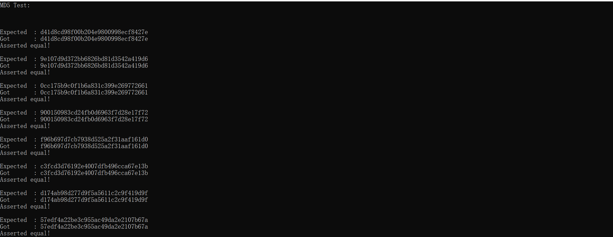
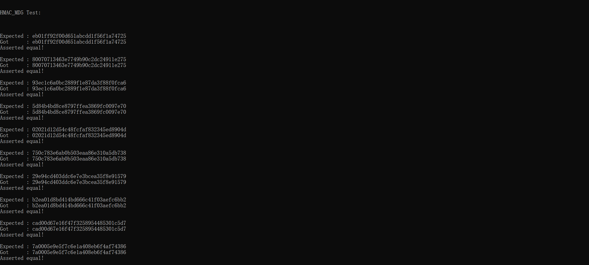

<!-- TOC -->

- [1. HMAC_MD5算法实现及报告](#1-hmac_md5算法实现及报告)
    - [1.1. 学生信息](#11-学生信息)
    - [1.2. MD5算法原理概述](#12-md5算法原理概述)
        - [1.2.1. 算法流程概述](#121-算法流程概述)
            - [1.2.1.1. 补位以及补数据长度](#1211-补位以及补数据长度)
            - [1.2.1.2. 初始化数据](#1212-初始化数据)
            - [1.2.1.3. 处理位操作函数](#1213-处理位操作函数)
            - [1.2.1.4. 最后数据的拼接](#1214-最后数据的拼接)
        - [1.2.2. 实验结果](#122-实验结果)
    - [1.3. HMAC实现](#13-hmac实现)
        - [1.3.1. 实验结果](#131-实验结果)
    - [1.4. 测试函数](#14-测试函数)
    - [1.5. 参考文献](#15-参考文献)

<!-- /TOC -->
# 1. HMAC_MD5算法实现及报告

## 1.1. 学生信息

- 姓名：曹芯瑜
- 学号：18342006

## 1.2. MD5算法原理概述

>参考rfc1321

### 1.2.1. 算法流程概述

>该算法中32位为一个字，8位为一个字节。

#### 1.2.1.1. 补位以及补数据长度

首先要进行的是将原文message进行补位，补位的目的是使补位后的长度模512余数为448。剩下64位的长度是为了下一个步骤放上数据长度。

补位的具体要求为先补一个1，之后全部补上0。至少补1位，最多补512位。

补数据长度就是把msg的数据长度用两个32位数来表示，取后64位（为了防止数据非常大溢出了64位的情况）。补后的最后结果为64（8个字节8个字节的看）的倍数。

```c++
void msgPadding(unsigned char* msg, int n, unsigned int** words, int* lengthWords) {
	//计算填充后的msg的总长
	//至少添加一位，最多添加512位
	//最终的总长要为64的倍数（算上补上数据长度后的总长）
	//+1是因为取余运算的原因，这里我们必须向上取，所以需要多补一位
	//（+8）的原因是为了保证留下64位（8字节）添加数据长度（如果加上这8没有超过64的倍数则没影响，超过了就说明原来的长度也不够，需要多添一点，比如原长若只有60字节，则不能保证留下64位（8字节）空间给数据长度，这个+8使得原长溢出了64，说明了长度不够需要多补一位）
	int block = (n + 8) / 64 + 1;
	int finalLen = block * 64;

	//先添一个位的1，之后全0
	unsigned char* paddedMsg = (unsigned char*)malloc(finalLen);
	for (int i = 0; i < n; i++)
		paddedMsg[i] = msg[i];
	paddedMsg[n] = (unsigned char)0x80;
	for (int i = n + 1; i < finalLen - 8; i++)
		paddedMsg[i] = 0;

	//padding数据长度到最后两个字
	unsigned long long tmp = (unsigned long long)n * 8;
	memcpy(paddedMsg + finalLen - 8, &tmp, 8);

    *******
}
```
#### 1.2.1.2. 初始化数据

需要几个初始化的缓冲器，以及一堆数组来记录一些默认值。用char类型数组储存方便之后的计算。

```c++
unsigned int S[64] = {
	7, 12, 17, 22,  7, 12, 17, 22,  7, 12, 17, 22,  7, 12, 17, 22,
	5,  9, 14, 20,  5,  9, 14, 20,  5,  9, 14, 20,  5,  9, 14, 20,
	4, 11, 16, 23,  4, 11, 16, 23,  4, 11, 16, 23,  4, 11, 16, 23,
	6, 10, 15, 21,  6, 10, 15, 21,  6, 10, 15, 21,  6, 10, 15, 21
};

// Use binary integer part of the sines of integers (Radians) as constants:
unsigned int K[64] = {
	//0~15
	0xd76aa478, 0xe8c7b756, 0x242070db, 0xc1bdceee,
	0xf57c0faf, 0x4787c62a, 0xa8304613, 0xfd469501,
	0x698098d8, 0x8b44f7af, 0xffff5bb1, 0x895cd7be,
	0x6b901122, 0xfd987193, 0xa679438e, 0x49b40821,
	//16~31
	0xf61e2562, 0xc040b340, 0x265e5a51, 0xe9b6c7aa,
	0xd62f105d, 0x02441453, 0xd8a1e681, 0xe7d3fbc8,
	0x21e1cde6, 0xc33707d6, 0xf4d50d87, 0x455a14ed,
	0xa9e3e905, 0xfcefa3f8, 0x676f02d9, 0x8d2a4c8a,
	//32~47
	0xfffa3942, 0x8771f681, 0x6d9d6122, 0xfde5380c,
	0xa4beea44, 0x4bdecfa9, 0xf6bb4b60, 0xbebfbc70,
	0x289b7ec6, 0xeaa127fa, 0xd4ef3085, 0x04881d05,
	0xd9d4d039, 0xe6db99e5, 0x1fa27cf8, 0xc4ac5665,
	//48~63
	0xf4292244, 0x432aff97, 0xab9423a7, 0xfc93a039,
	0x655b59c3, 0x8f0ccc92, 0xffeff47d, 0x85845dd1,
	0x6fa87e4f, 0xfe2ce6e0, 0xa3014314, 0x4e0811a1,
	0xf7537e82, 0xbd3af235, 0x2ad7d2bb, 0xeb86d391


    *a0 = 0x67452301;   // A
	*b0 = 0xefcdab89;   // B
	*c0 = 0x98badcfe;   // C
	*d0 = 0x10325476;   // D
	unsigned int M[16];
};
```

#### 1.2.1.3. 处理位操作函数

>此处严格依照wiki的伪代码实现

总共需要进行strlen（msg）/16次循环，在每次循环开始的时候需要用4个缓冲数据a0，b0，c0，d0进行初始化。然后进行16次循环，伪代码如下：
```
for each 512-bit chunk of padded message do
    break chunk into sixteen 32-bit words M[j], 0 ≤ j ≤ 15
    // Initialize hash value for this chunk:
    var int A := a0
    var int B := b0
    var int C := c0
    var int D := d0
    // Main loop:
    for i from 0 to 63 do
        var int F, g
        if 0 ≤ i ≤ 15 then
            F := (B and C) or ((not B) and D)
            g := i
        else if 16 ≤ i ≤ 31 then
            F := (D and B) or ((not D) and C)
            g := (5×i + 1) mod 16
        else if 32 ≤ i ≤ 47 then
            F := B xor C xor D
            g := (3×i + 5) mod 16
        else if 48 ≤ i ≤ 63 then
            F := C xor (B or (not D))
            g := (7×i) mod 16
        // Be wary of the below definitions of a,b,c,d
        F := F + A + K[i] + M[g]  // M[g] must be a 32-bits block
        A := D
        D := C
        C := B
        B := B + leftrotate(F, s[i])
    end for
    // Add this chunk's hash to result so far:
    a0 := a0 + A
    b0 := b0 + B
    c0 := c0 + C
    d0 := d0 + D
end for
```

实现如下所示
```c++
void ProcessMsg(unsigned int* a0, unsigned int* b0, unsigned int* c0, unsigned int* d0,unsigned int* words, int lengthWords) {
	// Initialize variables:
	*a0 = 0x67452301;   // A
	*b0 = 0xefcdab89;   // B
	*c0 = 0x98badcfe;   // C
	*d0 = 0x10325476;   // D
	unsigned int M[16];
	//参考wiki
	for (int i = 0; i < lengthWords / 16; i++) {
		unsigned  A = *a0;
		unsigned  B = *b0;
		unsigned  C = *c0;
		unsigned  D = *d0;
		for (int j = 0; j < 16; j++)
			M[j] = words[16 * i + j];

		for (int j = 0; j < 64; j++) {
			unsigned int F, g;
			if (j >= 0 && j <= 15) {
				F = (B & C) | ((~B) & D);
				g = j;
			}
			else if (j >= 16 && j <= 31) {
				F = (D & B) | ((~D) & C);
				g = (5 * j + 1) % 16;
			}
			else if (j >= 32 && j <= 47) {
				F = B ^ C ^ D;
				g = (3 * j + 5) % 16;
			}
			else if (j >= 48 && j <= 63) {
				F = C ^ (B | (~D));
				g = (7 * j) % 16;
			}
			F = F + A + K[j] + M[g];
			
			A = D;
			D = C;
			C = B;
			B = B + leftRotate(F, S[j]);
		}
		*a0 = *a0 + A;
		*b0 = *b0 + B;
		*c0 = *c0 + C;
		*d0 = *d0 + D;
	}
}
```

#### 1.2.1.4. 最后数据的拼接

需要将数据的a0，b0，c0，d0拼接起来，顺序为a0b0c0d0,这里我们需要输出的是字符串，使用sprintf函数时需要用到`%02x`，它的作用是将数据强制转换为十六进制字符。

在之后的HMAC中会使用到字节流的形式，在这里就一起实现了。

```c++
if (flag == 0) {
		for (int i = 0; i < 4; i++) {
			unsigned char s[9];
			sprintf_s(s, sizeof(s), "%02x%02x%02x%02x\0", tmp[i][0] & 0xff, tmp[i][1] & 0xff, tmp[i][2] & 0xff, tmp[i][3] & 0xff);
			//printf("i=%d,s=%s\n", i, s);
			strcat_s(res, strlen(res) + strlen(s) + 1, s);
		}
	}
	else {
		for (int i = 0; i < 4; i++) {
			unsigned char s[5];
			sprintf_s(s, sizeof(s), "%c%c%c%c\0", tmp[i][0] & 0xff, tmp[i][1] & 0xff, tmp[i][2] & 0xff, tmp[i][3] & 0xff);
			//printf("i=%d,s=%s\n", i, s);
			strcat_s(res, strlen(res) + strlen(s) + 1, s);
		}
	}
```

### 1.2.2. 实验结果



## 1.3. HMAC实现

>参考wiki上的伪代码实现

值得一提的是，伪代码中的return部分的hash函数（我们这里是用的MD5），经过同学的测试需要用到字节流的形式，所以在上面的MD5函数中添加了字节流输出的方式，在这里感谢同学的测试。

```c++
function hmac is
    input:
        key:        Bytes    // Array of bytes
        message:    Bytes    // Array of bytes to be hashed
        hash:       Function // The hash function to use (e.g. SHA-1)
        blockSize:  Integer  // The block size of the hash function (e.g. 64 bytes for SHA-1)
        outputSize: Integer  // The output size of the hash function (e.g. 20 bytes for SHA-1)
 
    // Keys longer than blockSize are shortened by hashing them
    if (length(key) > blockSize) then
        key ← hash(key) // key is outputSize bytes long

    // Keys shorter than blockSize are padded to blockSize by padding with zeros on the right
    if (length(key) < blockSize) then
        key ← Pad(key, blockSize) // Pad key with zeros to make it blockSize bytes long

    o_key_pad ← key xor [0x5c * blockSize]   // Outer padded key
    i_key_pad ← key xor [0x36 * blockSize]   // Inner padded key

    return hash(o_key_pad ∥ hash(i_key_pad ∥ message))
```

代码如下：
```c++
//参考wiki
unsigned char* HMAC(unsigned char* k, unsigned char* msg, int blockSize) {
	unsigned char* key;

	// Keys longer than blockSize are shortened by hashing them
	if (strlen(k) > blockSize)key = MD5(k,1);
	else key = k;

	// Keys shorter than blockSize are padded to blockSize by padding with zeros on the right
	if (strlen(key) < blockSize) {
		unsigned char* tmp = (unsigned char*)malloc(blockSize);
		for (int i = 0; i < strlen(key); i++)
			tmp[i] = key[i];
		for (int i = strlen(key); i < blockSize; i++)
			tmp[i] = 0x00;
		tmp[blockSize] = '\0';
		key = tmp;
	}

	unsigned char o_pad = 0x5c;
	unsigned char i_pad = 0x36;
	unsigned char* o_key_pad = (unsigned char*)malloc(blockSize);// Outer padded key
	unsigned char* i_key_pad = (unsigned char*)malloc(blockSize);// Inner padded key
	
	//异或操作
	for (int i = 0; i < blockSize; i++) {
		o_key_pad[i] = key[i] ^ o_pad;
		i_key_pad[i] = key[i] ^ i_pad;
	}
	o_key_pad[blockSize] = '\0';
	i_key_pad[blockSize] = '\0';

	/*
		*计算hash(o_key_pad ∥ hash(i_key_pad ∥ message))
		* ||表示连接起来
		* hash的时候需要采用字节流的形式，所以先用字节流计算最后再转回字符串形式输出
	*/
	int len1 = strlen(i_key_pad) + strlen(msg) + 1;
	int len2 = strlen(o_key_pad) + len1 + 1;

	unsigned char* res1 = (unsigned char*)malloc(len1);
	unsigned char* res2 = (unsigned char*)malloc(len2);
	res1[0] = '\0';
	res2[0] = '\0';

	strcat_s(res1, len1, i_key_pad);
	strcat_s(res1, len1, msg);
	res1 = MD5(res1, 1);
	strcat_s(res2, len2, o_key_pad);
	strcat_s(res2, len2, res1);
	unsigned char* res = MD5(res2,0);
	
	free(res1);
	free(res2);

	return res;
}
```
### 1.3.1. 实验结果



## 1.4. 测试函数

测试函数参考朋友的写法以及测试用例，在HMAC测试时自己在网上写了不少测试数据

这里贴上HMAC的测试函数和用例（HMAC正确的话MD5理论是一定正确的）

```c++
//hmac_md5 example
unsigned char* HMAC_MD5_cases_keys[] = {
	"key",
	"key",
	"key",
	"12345678901234567890123456789012345678901234567890123456789012345678901234567890",
	"12345678901234567890123456789012345678901234567890123456789012345678901234567890",
	"Jefe",
	"sysu",
	"sysu",
	"sysu12345caoxy7didhavenotlike4326094tekken4367originoftesigsn93586",
	"sysu12345caoxy7didhavenotlike4326094tekken4367originoftesigsn93586"
};

unsigned char* HMAC_MD5_cases_data[] = {
	"Hi There",
	"The quick brown fox jumps over the lazy dog",
	"Test Using Larger Than Block-Size Key and Larger Than One Block-Size Data",
	"Hi There",
	"The quick brown fox jumps over the lazy dog",
	"what do ya want for nothing?",
	"Hello World",
	"an iterative hash function breaks up a message into blocks of a fixed size and iterates over them with a compression function",
	"an iterative hash function breaks up a message into blocks of a fixed size and iterates over them with a compression function",
	"Hello World"
};
unsigned char* HMAC_MD5_expected[] = {
	"eb01ff92f00d651abcdd1f56f1a74725",
	"80070713463e7749b90c2dc24911e275",
	"93ec1c6a0bc2889f1e87da3f88f0fca6",
	"5d84b4bd8ce8797ffea3869fc0097e70",
	"02021d12d54c48fcfaf832345ed8904d",
	"750c783e6ab0b503eaa86e310a5db738",
	"29e94cd403ddc6e7e3bcea35f8e91579",
	"b2ea01d8bd414bd666c41f03aefc6bb2",
	"cad00d67e16f47f3258954485301c5d7",
	"7a0005e9e5f7c6e1a408eb6f4af74386"
};

printf("\n\n\n\nHMAC_MD5 Test:\n\n\n\n");
	for (int i = 0; i < 10; i++)
	{
		unsigned char* key = HMAC_MD5_cases_keys[i];
		unsigned char* data = HMAC_MD5_cases_data[i];
		unsigned char* expeted = HMAC_MD5_expected[i];
		unsigned char* myResult=(unsigned char*)malloc(65);
		myResult[0] = '\n';
		
		unsigned char* s=HMAC(key, data, 64, &myResult);
		printf("Expected : %s\n", expeted);
		printf("Got      : %s\n", s);
		if (strcmp(s, expeted) == 0)
			printf("Asserted equal!\n");
		else
			printf("Not equal!\n");
		printf("\n");
	}
```

## 1.5. 参考文献

[RFC1321](https://tools.ietf.org/html/rfc1321#section-3.1)
[MD5Algorith-wiki](https://en.wikipedia.org/wiki/MD5#Algorithm)
[HMAC-wiki](https://en.wikipedia.org/wiki/HMAC#Implementation)
[HMAC测试样例生成网站](https://asecuritysite.com/encryption/hmac)